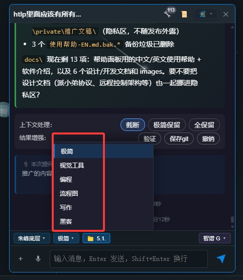
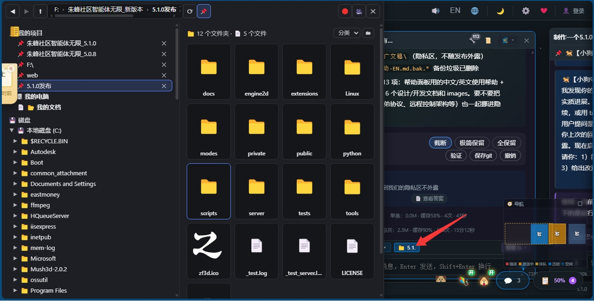
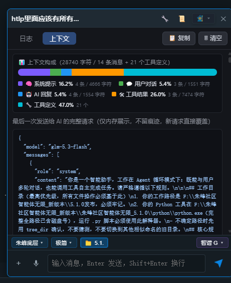
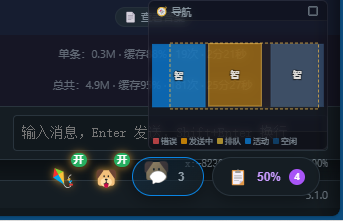
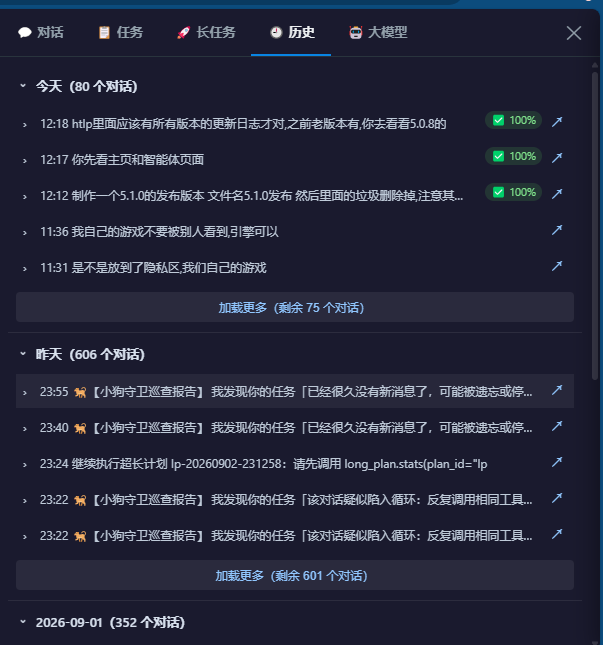

# ZF3D Community Agent Infinity 5.1.0 · Introduction

## In One Sentence

**One infinite canvas, an AI team that actually gets work done.** It doesn't just chat — it breaks down goals, calls tools, verifies results on its own, self-repairs after failures, dispatches multiple AI "helpers" to collaborate, and can even remote-control other computers.

Free & open source · Multi-model, multi-dialog · Windows / Linux / Web · Pure Python standard library, zero dependencies, double-click to run

---

## What Can It Do?

In one sentence: **turn a large model into a team that works on your computer.**

### 🧠 Agentic Execution
- **True autonomous execution**: read/write files, run code, fetch from the web, Git commits, scheduled tasks, cross-dialog search, databases, long-term plans — not just answers, but hands-on completion and verification
- **Long-term plans**: big tasks are auto-split into batches and continued across dialogs; close the app and pick up tomorrow
- **Dual guardians**: health guardian + puppy guard auto-rescues failed tasks and intervenes on stalls

### 🤖 Multi-Agent Collaboration
- **400+ parallel dialogs**: each dialog is an independent agent with its own model, tools and context
- **Dispatch protocol**: the master brain assigns work, helpers do it, a supervisor accepts the delivery — with receipts and triple-check acceptance
- **Kite system**: dialog monitoring dialog, one-on-one kite voice chat

### 🌐 Connect Everything
- **Multi-model**: DeepSeek, Qwen, Zhipu GLM, Doubao, Kimi, GPT, Claude, Gemini, Hunyuan, ERNIE, Ollama, and any OpenAI-compatible endpoint
- **Six engine backends**: Claude Code / Codex / DeepSeek direct / Hermes / OpenClaw / Pi style, plug and play
- **Extension ecosystem**: MCP integration (including 3ds Max / Houdini bridges), skill system, plugin mode, declarative UI

### 🎨 Multimodal Creation
- Text-to-image, video generation, TTS voice, voice input, pixel animation, SVG animation workshop
- **AIGC publishing system**: AI publishes works directly to the ZF3D community

## Positioning Comparison

| Traditional AI Chat | ZF3D Agent Infinity |
|---|---|
| One question, one answer | Autonomous breakdown, execution, verification, reporting |
| Single dialog | 400+ parallel dialogs, multi-agent dispatch and collaboration |
| Data in the cloud | All local, API keys stored in private/, never uploaded |
| Install environments and dependencies | Pure Python standard library, double-click to run |
| Manual rescue on errors | Guardian processes auto-rescue + receipt acceptance |

## Screenshot Tour / 界面预览

| | | |
|---|---|---|
|  |  |  |
| *Main UI · Infinite Canvas* | *400+ Parallel Dialogs* | *Coding Modes* |
|  |  |  |
| *Six Engine Backends* | *Model Config Manager* | *Task List & Long Plans* |
|  |  |  |
| *Kite & Puppy Guards* | *File Tree & Thumbnails* | *Logs & Context* |

## Links

| Channel | Link |
|---|---|
| 🏠 ZF3D Community (intro & download) | https://www.zf3d.com/agent.asp |
| 🇨🇳 Gitee | https://gitee.com/zf3d/zf3d_agent |
| 🌍 GitHub | https://github.com/zf3dzf3dzf3d-ctrl/zf3d_agent |
| 📺 Bilibili (demos & tutorials) | https://space.bilibili.com/39993282 |


# ZF3D Community Agent Infinity 5.1.0 - Complete Help (Full Documentation with Screenshots)

> This document covers all current features of the software, written after a feature-by-feature code review (~150 frontend modules in public/js, server/ route Mixins and six engines, the three toolkits in tool/, extensions/, plugin modes in modes/, and archived notes in 项目记录/).

---

## Table of Contents

1. [Overview](#1-overview)
2. [Startup & Quick Start](#2-startup--quick-start)
3. [Infinite Canvas Workbench](#3-infinite-canvas-workbench)
4. [Chat Boxes & Chat System](#4-chat-boxes--chat-system)
5. [Agent Execution Engine (Three Modes)](#5-agent-execution-engine-three-modes)
6. [Six Built-in Engines](#6-six-built-in-engines)
7. [Three Toolkits (83 Tools)](#7-three-toolkits-83-tools)
8. [Divergent-Convergent Multi-Perspective Chat](#8-divergent-convergent-multi-perspective-chat)
9. [Long Plan System](#9-long-plan-system)
10. [Dog Guard + Guard Ledger](#10-dog-guard--guard-ledger)
11. [Health Guard v2 (Sedentary Reminder)](#11-health-guard-v2-sedentary-reminder)
12. [Voice Feature Suite](#12-voice-feature-suite)
13. [AI Multimodal (Text-to-Image / Video / TTS / Pixel Animation)](#13-ai-multimodal)
14. [Chat Modes (Plugin Modes) & Model Config Agent](#14-chat-modes--model-config-agent)
15. [Extension Ecosystem (MCP / Skills / Declarative UI)](#15-extension-ecosystem)
16. [Project / File / Memory Systems](#16-project--file--memory-systems)
17. [Panels & Settings Center](#17-panels--settings-center)
18. [UI Personalization & Accessibility](#18-ui-personalization--accessibility)
19. [Security & Privacy](#19-security--privacy)
20. [Data Backup & Restore](#20-data-backup--restore)
21. [Desktop Helper Programs (Standalone Server Components)](#21-desktop-helper-programs)
22. [Directory Structure Quick Reference](#22-directory-structure-quick-reference)
23. [FAQ](#23-faq)

---

## 1. Overview

**Zhufeng Community Agent Unlimited (Infinity)** is a locally running AI agent workbench built around an "infinite canvas" that lays multi-turn chats, tool calls, text-to-image, video generation, and task management all on the same canvas. Core traits:

- **Truly autonomous execution**: the AI breaks your request into steps, calls tools one by one, verifies proactively, and reports "Task complete" when done.
- **Multi-chat in parallel**: give different tasks to multiple chat boxes at once.
- **Data stays local**: everything runs locally; API keys live in private/ and never leave your machine.
- **Zero-setup**: ships with a bundled Python 3.11 runtime — unzip and run.
- **Self-protection**: Health Guard + Dog Guard double safety net; failed tasks are auto-revived and stalls trigger intervention.

---

## 2. Startup & Quick Start

1. Download and unzip anywhere (Windows 10/11 64-bit; a Linux/start.sh startup script and instructions are also provided).
2. Double-click the start .bat (no Python installation needed).
3. Configure models / APIs as prompted and start chatting.

> Make sure the program directory has read/write permission on first run. Version number is in private/version.json.

---

## 3. Infinite Canvas Workbench

### 3.1 Canvas Basics
- **Free pan / zoom**: drag and scale the canvas freely (app-canvas.js).
- **Double-click create**: double-click empty canvas to open the creation panel — new chat / image / video / prompt panels, etc.
- **Right-click quick create**: right-click empty canvas for a "quick-create bar" (with send / voice input) that reuses all your last settings.
- **Tab quick create**: press Tab anywhere for a minimal create bar — start and send a new chat in one step.
- **Minimap** (app-minimap.js): thumbnail in the bottom-right corner for navigating large canvases.
- **Undo** (app-undo.js): canvas actions are undoable/redoable (including chat history restore).
- **Background effects** (background.js, space-meteors.js): canvas background effects (e.g. meteors) with separately persisted settings.
- **Click effects** (server click_effect.py): mouse click feedback.

### 3.2 Kite Node System
- **Kite nodes & links** (app-kite-core/links/nodes/panels.js): nodes shown as kites on the canvas, linked together (including port links, app-kiteportlink.js).
- **Kite vision** (app-kite-vision.js): vision capabilities.
- **Kite Voice Chat**: click the kite head (single click, not drag) to open a dedicated voice chat window (kite-voice-chat.js) — pure voice one-on-one: you speak, it listens; when the AI finishes it listens again, like a phone call.
- **Kite head drag**: drag to reposition the anchor without disturbing the voice panel.

### 3.3 Media Nodes
- **Image node / viewer** (app-imagenode.js, app-imageviewer.js, image-node.js): view and zoom images on canvas.
- **Media drag** (app-mediadrag.js): drag media files onto the canvas.
- **Media node** (app-medianode-x.js): video and other media nodes.
- **Channel panel** (panel-image-channels.js): image channel management.

---

## 4. Chat Boxes & Chat System

- **Multi-chat management** (app-chatmgr.js, app-chatbox-projects.js): many chat nodes on one canvas, each with its own task.
- **Chat interaction** (chatbox-03-chat-interaction.js): sending and streaming reply rendering (Markdown + code highlight + Mermaid diagrams), fully async with no lag.
- **Model selector** (chatbox-01-model-selector.js): pick a different model per chat.
- **Send status** (agent-00-send-status.js): sending / done status; chats stopped mid-run can still continue sending.
- **Success arrow & result jump** (chatbox-02-success-arrow.js): when done, shows "View success N" / "View verification result" buttons that fly the camera to the answer on canvas.
- **Message sanitizing** (agent-02b/02c): auto-cleans fake tool tags and other abnormal output.
- **Paste-as-card**: large pastes (>80 chars or containing newlines) become small removable cards; the AI can distinguish typed text from pasted content.
- **Ask User** (agent-04-ask-user.js): the AI can ask you questions (single-line / form mode) and pause for your answer.
- **Task list panel** (app-taskpanel.js): live progress display of the AI's task list.
- **Toasts** (chatbox-00-toast.js, toast-stack.js): global lightweight notifications.

---

## 5. Agent Execution Engine (Three Modes)

Each chat can choose an execution mode (agent-02-loop-core.js loop core + mode picker):

| Mode | Description |
|---|---|
| Direct chat | Pure conversation, no tools |
| Tool loop | AI may call tools before answering |
| Autonomous loop | Fully autonomous: break into steps, execute, verify, report — until the task is done |

Supporting capabilities:
- **Tool result management** (agent-03-tool-results.js): result card rendering, archiving and retrieval of oversized results.
- **Reasoning levels** (reasoning-levels.js): adjustable model thinking depth.
- **Project memory** (agent-01-project-memory.js): chats auto-record working memory, recalled across turns.
- **Error handling** (agent-errors.js): retry and hints on failure.
- **Chat mode memory**: the currently selected mode becomes the default for next time.

---

## 6. Six Built-in Engines

The server ships with six pluggable engine styles (server/engines/), each with its own toolset:

| Engine | Style / Tools |
|---|---|
| Claude Code style | Read / Write / Edit / Bash etc. |
| Codex style | codex_* tool family |
| DeepSeek direct | ds_* tool family |
| Hermes style | hermes tool family |
| OpenClaw style | openclaw tool family |
| Pi style | pi tool family |

- All engine toolsets fully re-tested with correct schemas; a lost registry falls back to an empty one with a warning.
- Tool injection works in both cloud and local modes (import path issue fixed).
- See server/engines/how-to-add-agent.md for adding new engines.

---

## 7. Three Toolkits (83 Tools)

Tool definitions are split across files (tools-defs-*.js frontend + tool/ server implementations), switched by category (tools-00-category-state.js, tools-02-category-switch.js):

| Toolkit | Count | Main abilities |
|---|---|---|
| Minimal | 16 | Read/write files, run commands, directory search, task lists, ask-user, etc. |
| Coding | 27 | Git commits, scheduled tasks, monitoring queues, database read/write, canvas positioning, long plans (create/update/claim/report/handoff), etc. |
| Writing | 40 | Polishing, summarization, sensitivity checks, SEO optimization, multi-role review, etc. |

- **Execution chain**: tools-04-execute.js + tools-05-execute-api.js call the server; tools-06-card-render.js renders results as cards.
- **System prompt injection** (tools-03-system-prompt.js): per-toolkit instructions injected automatically.
- **Tool stats** (project-toolstats.js): per-chat tool call counts.
- **Video generation engine** (tool/video_gen_engine.py, tools/): server-side video generation.

---

## 8. Divergent-Convergent Multi-Perspective Chat

(diverge.js, see the archived project note)

- Send out a squad of AIs in one sentence: engineer, designer, programmer and other **perspectives** (2–6, customizable) each speak.
- Built-in presets: **Project Development / SWOT / Brainstorm**.
- Sub-chats appear on canvas with live animated links showing each viewpoint.
- **One-click convergence**: summaries merge back into the parent chat; loop "diverge then converge" to approach the best solution.

---

## 9. Long Plan System

(app-longplan-panel.js + toolset tools-defs-longplan.js, persisted in the project-record folder)

For large tasks of 5+ steps:

- The AI automatically **breaks a big task into batches of steps** and creates a plan file (goal / steps / deliverables / acceptance criteria).
- **Batched execution**: claim, execute, per-step report, handoff — preventing context overflow.
- **Cross-chat continuation**: close the software and come back tomorrow; a new chat resumes seamlessly (progress overview + next pending steps).
- Plan panel visualizes progress and execution logs.

---

## 10. Dog Guard + Guard Ledger

(app-dog-guard.js, dog avatar tied to the theme)

- **All-day patrol**: automatically checks all chats on a schedule.
- **Auto-revive**: when a task fails outright, it injects fix guidance so it can continue.
- **Stall intervention**: on run timeouts / tool-call stalls (suspected dead loops), pauses and injects a plan.
- **Idle patrol**: idle chats get routine checks, all logged.
- **Guard Ledger**: everything the guard does (revivals, patrols, intervention reasons, times) is recorded and always viewable.
- **Integration**: guard supports voice input and session-theme linkage.

---

## 11. Health Guard v2 (Sedentary Reminder)

(app-health.js + server config)

- **Sedentary reminders**: reminds you to rest after long continuous work.
- **Forced break lock**: locks the screen at break time.
- **Only counts "you're present" time**: pauses when it detects you're away, resumes after the break — smarter than a Pomodoro timer.
- **Monitoring dashboard** (app-monitor.js, panel-log-health.js): system status and log health visualization.

---

## 12. Voice Feature Suite

| Feature | Description |
|---|---|
| Voice input | Mic buttons in every chat window (chats, butler, guard, Kite voice chat); speech-to-text (voice-input.js) |
| Voice auto-send | Say "send / submit" after your message to auto-submit without misfires |
| Kite voice chat | Click the kite head for a voice window: Web Speech continuous recognition + Edge TTS replies, auto re-listening after each answer |
| TTS read-aloud | Edge online voices read AI replies aloud (tts.js + server tts_engine.py) |
| Audio recording | Server audio_recorder.py, audio resources, audio/video plugin support |

---

## 13. AI Multimodal

- **Text-to-image**: agent-02a-imagegen-direct.js direct generation; images land on canvas image nodes.
- **Video generation**: server-side video engine (tool/video_gen_engine.py, tools/), played in media nodes.
- **TTS voice engine**: see previous section.
- **Pixel animation** (pixel-display.js, pixel-panel.js + server mixin_pixel.py): pixel animation display and GIF export.
- **RAG knowledge base** (server/rag_engine.py, rag_api.py, kb.db): local knowledge retrieval to enhance answers.

---

## 14. Chat Modes & Model Config Agent

- **Plugin mode system** (modes/ + mode_loader.py + mode_panel_loader.js): extensible chat modes with a _template starter; currently includes **config_agent (Model Config Butler)**:
  - Add/edit/remove model configs conversationally, look up upstream model lists online, panels sync in real time after changes.
  - Route dropdowns, collapsible tools, theme adaptation.
- **Model config management** (panel-models.js, models.js, model-config-rewrite.js + server mixin_models.py, model_config.py): multi-model multi-route configs, prompt generation, masked-key restore.
- **Chat mode rules** (chat_mode_rules.py): per-mode system rule injection.

---

## 15. Extension Ecosystem

(extensions/)

- **MCP protocol integration** (mcp.py): a full **Model Context Protocol client gateway**. External MCP server configs live in `private/extensions/mcp_servers.json`; supports both **HTTP(SSE) and stdio** transports; implements initialize / tools/list / tools/call over JSON-RPC 2.0; external MCP tools are auto-converted into OpenAI function calling schemas for the main agent. API: `GET /api/ext/mcp/tools`, `POST /api/ext/mcp/call`. Standalone file design — can be removed without affecting the core.
- **Skills system** (skills.py, skills/): installable skill packs that inject capability prompts into the AI.
- **Declarative UI** (declarative_ui.py): extensions can declare their own interfaces.
- **Extension manager panel** (ext-manager.js, ext-settings-panel.js, ext-ui-render.js): enable/disable and settings.
- **Frontend bridge** (ext-bridge.js): async communication between extensions and the main app (fully async, doesn't block sending).
- **Plugin mode system** (modes/ + mode_loader.py + mode_panel_loader.js): extensible chat-mode plugins with a `_template` scaffold for writing new plugin modes (built-in: config_agent Model Config Butler).
- **Plugins** (plugins/audio-video-plugin): audio/video processing.
- **Office preview** (tools/office-viewer): PPT and other Office file preview (standalone module).

---

## 16. Project / File / Memory Systems

- **Project switcher** (project-switcher.js): multi-project switching; the current project is injected as context.
- **Project folder** (project-folder.js + server mixin_project.py): project file read/write and filesystem ops.
- **File tree** (app-filetree.js): side file tree browsing (first-project display bug fixed).
- **Project sessions** (project-sessions.js): session management within a project.
- **Project sync** (project-sync.js): project data syncing.
- **Project memory**: see section 5.
- **Project record system**: every feature and fix is auto-archived as Markdown notes (bugfix-/feature- series + worklogs) — the software's "medical chart".
- **Project log panel** (project-logpanel.js).
- **Upload** (app-upload.js): upload files into a project.
- **Update check** (app-update.js, app-version.js, tool/check_release.py): version check and updates.

---

## 17. Panels & Settings Center

(app-panels.js and panel-* modules + server mixin_settings.py)

- **Settings panel** (panel-settings.js, user-settings.js, settings-rewrite.js): JSON read/write for various configs (health guard / loop modes / user settings, etc.).
- **Models panel** (panel-models.js).
- **Mail panel** (panel-mail.js).
- **Tools settings** (tools-settings.js): tool toggles and categories.
- **User info** (app-userinfo.js).
- **Panel copy** (panel-copy.js): copy panel contents.
- **Backup panel** (app-backup.js): see section 20.
- **ZF3D panel** (app-zf3d.js + server mixin_zf3d.py): community integration.

---

## 18. UI Personalization & Accessibility

- **Theme system** (theme.js): multiple themes (incl. guard-theme linkage).
- **Bilingual UI (EN/CN)** (i18n.js): 1000+ entries fully covered, one-click language switch.
- **Hot reload** (hot-reload.js + server mixin_hotreload.py, hot_reload.py): frontend/server modules take effect on save, no restart; hot-reload status view and manual reload.
- **Lazy loading** (lazy-loader.js): scripts lazy-loaded in order for faster startup.
- **UI proxy** (server/mixin_proxy.py): API proxy for third-party AI services, streaming SSE, system prompt injection.
- **API security** (server/security.py, _scan_auth*): auth and security scanning.

---

## 19. Security & Privacy

- All data stays local; no privacy content is uploaded.
- API keys and sensitive configs live in private/, excluded from Git.
- **Settings export / import**: one-click migration; "privacy zone" export is controllable; **exports never contain API keys**.
- High-risk operations (file deletion, system config changes) require manual confirmation (Ask User mechanism).

---

## 20. Data Backup & Restore

(app-backup.js + server mixin_backup.py)

- **Zip snapshot backup**: one-click project snapshots.
- **Restore / delete**: restore or delete from snapshots.
- File-modifying tools auto-create timestamped .bak backups so mistakes can be rolled back.

---

## 21. Desktop Helper Programs

A set of standalone desktop components shipped with the server (server/*.py, incl. tray / quick entries):

| Component | Function |
|---|---|
| quick_launcher.py + config | Quick launcher |
| quick_wheel.py | Quick wheel menu |
| global_hotkey.py | Global hotkeys |
| screenshot_capture.py | Screenshot capture |
| area_selector.py | Area selection |
| screen_recorder.py | Screen recording |
| desktop_chat.py | Desktop chat floating window |
| audio_recorder.py | Audio recording |
| drag_listener.pyw + start/stop scripts | Drag listener (one-click on/off) |
| watchdog.py, zf3d_heartbeat.py, monitor_watch.js | Watchdog and heartbeat monitoring |
| zf3d.ico | Program icon |

---

## 22. Directory Structure Quick Reference

```
ZhufengAgentUnlimited_5.1.0/
├── server/      # App server (HTTP route Mixin, six engines, RAG/TTS, hot reload, desktop components)
├── public/      # Frontend (infinite canvas, diverge-converge, dog guard, long-plan panel, voice)
├── python/      # Bundled Python 3.11 runtime
├── tool/        # Three toolkits (minimal / coding / writing) + video generation engine
├── tools/       # Video generation engine, Office preview
├── plugins/     # Audio/video plugin
├── extensions/  # MCP, skills, declarative UI
├── modes/       # Plugin modes (config_agent)
├── scripts/     # Release & script generation tools
├── tests/       # Tests
├── demo/        # Demo
├── docs/        # Docs & history
├── private/     # Private configs (API keys, not committed)
├── Linux/       # Linux startup script and instructions
└── ProjectRecords/  # Auto-archived feature & fix notes
```

---

## 23. FAQ

**Q: How do I start?**
Unzip, double-click the start .bat, configure model API, then double-click empty canvas (or right-click / press Tab) to create your first chat.

**Q: Sending feels laggy?**
The old synchronous-request blocking is fully fixed; hard-refresh the browser with Ctrl+F5.

**Q: Task too big to finish?**
Just hand it over — it auto-creates a "Long Plan" and executes in batches; close the software and a new chat continues seamlessly tomorrow.

**Q: Chat frozen?**
Dog Guard auto-revives it (on stall timeouts it pauses and injects fix guidance to continue); check the "Guard Ledger" to see what it did.

**Q: Migrating to a new computer?**
Use "Settings export / import"; the privacy zone is controllable and API keys are never exported — configure them separately.

**Q: Will the AI delete my files?**
High-risk operations like deletion and system config changes require your confirmation; file modifications also keep automatic .bak backups, and canvas actions support Undo.

**Q: What must be done before releasing a new version?**
⚠️ Read and execute the release checklist at `private/用户设置/release_checklist.json` first. Key items: 1) clear the pinned projects (ft_pins) — pinned paths are personal state and must be emptied (`ft_pins: []` in user_settings.json); 2) clean personal data in private/ (empty api_keys.json, remove db/, server.pid, worklog.json, backups/); 3) confirm version.json and port.json are updated.

---

---


---

# 朱峰社区智能体无限（Infinity）5.1.0 · 软件介绍

## 一句话介绍

**一块无限画布，一个真正干活的 AI 团队。** 它不止会聊天——会拆解目标、调用工具、自主验证、失败自修，还能派出多个 AI「小弟」协作完成任务，甚至跨电脑互相远程操控。

免费开源 · 多模型多对话 · Windows / Linux / Web · 纯 Python 标准库零依赖双击即用

---

## 它能做什么？

一句话：**把大模型变成一支在你电脑上干活的团队。**

### 🧠 智能执行
- **真·自主执行**：读写文件、运行代码、联网抓取、Git 提交、定时任务、跨对话搜索、数据库、超长计划——不只回答，而是动手做完并验证
- **超长计划**：大任务自动拆批、跨对话接力，关掉软件明天接着干
- **双守护**：健康守护 + 小狗守卫，任务失败自动救、停滞主动干预

### 🤖 多智能体协作
- **400+ 对话并行**：每个对话都是独立智能体，有自己的模型、工具和上下文
- **派小弟协议**：主脑派活、小弟干活、监工验收，回执单 + 三关验收
- **风筝系统**：对话监控对话、风筝语音一对一聊天

### 🌐 连接一切
- **多模型**：DeepSeek、通义千问、智谱 GLM、豆包、Kimi、GPT、Claude、Gemini、混元、文心、Ollama，任意 OpenAI 兼容接口
- **六大底层引擎**：Claude Code / Codex / DeepSeek 直连 / Hermes / OpenClaw / Pi 风格，即插即用
- **扩展生态**：MCP 接入（含 3ds Max / Houdini 桥接）、技能系统、插件模式、声明式 UI

### 🎨 多模态创作
- 文生图、视频生成、TTS 语音、语音输入、像素动画、SVG 动画工坊
- **AIGC 发布系统**：AI 直接在朱峰社区发布作品

## 定位对比

| 传统 AI 聊天 | 朱峰智能体无限 |
|---|---|
| 一问一答 | 自主拆解、执行、验证、汇报 |
| 单对话 | 400+ 对话并行，多智能体派工协作 |
| 数据在云端 | 全部本地，API Key 存 private/ 不外传 |
| 要装环境配依赖 | 纯 Python 标准库，双击即用 |
| 出错人工兜底 | 守护进程自动救 + 回执验收 |


---
# 朱峰社区智能体无限（Infinity）5.1.0 · 完整帮助（带截图全文档）

---

## 📖 目录 · 六大部分导航

---

### 🚀 第一部分 · 快速上手（新人从这里开始）
| 章 | 内容 | 适合谁 |
|---|---|---|
| 〇 | [版本变化](#〇版本变化版本发展史从新到旧) | 想了解升级内容的用户 |
| 一 | [软件是什么](#一软件是什么) | 所有人 |
| 二 | [安装与启动](#二安装与启动) | 所有人 |
| 三 | [10 分钟快速上手](#三10-分钟快速上手) | 所有人 |

### 🎨 第二部分 · 画布工作台（日常操作主界面）
| 章 | 内容 | 适合谁 |
|---|---|---|
| 四 | [无限画布基础操作](#四无限画布基础操作) | 所有人 |
| 五 | [对话框节点详解](#五对话框节点详解) | 所有人 |
| 六 | [画布流水线与流程图（5.1.0）](#六画布流水线与流程图510) | 进阶用户 |

### 👥 第三部分 · 多智能体协作（让多个 AI 分工干活）
| 章 | 内容 | 适合谁 |
|---|---|---|
| 七 | [派小弟协议：多智能体派工（5.1.0）](#七派小弟协议多智能体派工510) | 进阶用户 |
| 八 | [风筝系统](#八风筝系统) | 进阶用户 |
| 九 | [发散收敛多视角对话](#九发散收敛多视角对话) | 进阶用户 |
| 十 | [跨主机远程控制（5.1.0）](#十跨主机远程控制510) | 有多台电脑的用户 |

### 🧠 第四部分 · AI 能力（引擎、模型与知识）
| 章 | 内容 | 适合谁 |
|---|---|---|
| 十一 | [Agent 执行引擎与工具系统](#十一agent-执行引擎与工具系统) | 所有人 |
| 十二 | [六大底层引擎](#十二六大底层引擎) | 所有人 |
| 十三 | [多模型配置与模型配置管家](#十三多模型配置与模型配置管家) | 所有人 |
| 十四 | [超长计划系统](#十四超长计划系统) | 大任务用户 |
| 十五 | [知识图谱系统（5.1.0）](#十五知识图谱系统510) | 进阶用户 |

### 🖼️ 第五部分 · 多模态与语音（图片 / 视频 / 语音）
| 章 | 内容 | 适合谁 |
|---|---|---|
| 十六 | [文生图 / 视频生成 / 像素动画](#十六文生图--视频生成--像素动画) | 创作用户 |
| 十七 | [语音功能全家桶](#十七语音功能全家桶) | 创作用户 |

### 🛠️ 第六部分 · 管理与维护（系统运维与故障排查）
| 章 | 内容 | 适合谁 |
|---|---|---|
| 十八 | [项目 / 文件 / 记忆系统与变更溯源](#十八项目--文件--记忆系统与变更溯源) | 所有人 |
| 十九 | [守护系统：小狗守卫 + 健康守护](#十九守护系统小狗守卫--健康守护) | 所有人 |
| 二十 | [扩展生态（MCP / 技能 / 插件模式）](#二十扩展生态) | 进阶用户 |
| 二十一 | [面板与设置中心](#二十一面板与设置中心) | 所有人 |
| 二十二 | [安全与隐私](#二十二安全与隐私) | 所有人 |
| 二十三 | [数据备份与急救箱](#二十三数据备份与急救箱) | 出问题时看 |
| 二十四 | [目录结构速查](#二十四目录结构速查) | 出问题时看 |
| 二十五 | [常见问题 FAQ](#二十五常见问题-faq) | 出问题时看 |

> 💡 **按场景查找**：第一次用→看第一部分｜不会操作画布→第二部分｜想让多个 AI 协作→第三部分｜AI 不干活/想换模型→第四部分｜想做图做视频→第五部分｜软件出问题→第六部分

---

# 第一部分 · 上手

## 〇、版本变化（版本发展史，从新到旧）

> 各版本的主要变化一览，方便老用户快速了解升级内容。当前版本：**v5.1.0**。

### v5.1.0（2026-09）—— 多智能体协作与远程控制时代
- 跨主机远程控制（盲配对 + 端到端加密 + 影子界面）
- 知识图谱系统（实体-关系抽取 + 可视化 + AI 问答）
- 派小弟协议 v1.1（派发/监控/回收/验证四段流水线 + 三关验收）
- 目标链统一协议（唯一目标源是人类，全链可追溯）
- 画布流水线（Mermaid 流程图部署成真实执行的对话节点）
- 文件变更溯源（自动变更日志与文件变更索引）
- FlowGlam 炫酷流程图渲染

### v5.0.6 ~ v5.0.8（2026-08~09）—— 画布体验打磨时代
- 发散收敛多视角对话：一句话派出一队 AI（工程师/美工/程序员等视角），画布连线实时动画，一键收敛汇总
- 画布流水线雏形开发
- 模型配置管家：对话式增删改模型配置、联网查上游模型列表
- 任务结果直达按钮、文件浏览分页提速、508 乱码等一批稳定性修复
- 清空钉住项目规则、重启转圈修复等细节优化

### v5.0.5（2026-08 末）—— 守护与计划时代
- **超长计划系统（Long Plan）**：50~100+ 步超长任务持久化为 Markdown 计划，分批认领执行、跨对话接力
- **小狗守卫 · 守护账本**：失败自动救、停滞 10 分钟干预、空闲巡逻，动作全部记账可查
- **急救箱恢复内核**：自检、对话式修复、一键还原核心快照（`rescue/启动急救箱.bat`）
- **健康守护 v2**：只计「人在」时间的久坐提醒与强制休息
- 设置导出/导入、语音命令自动发送、朗读助手（Edge TTS）、粘贴卡片化、撤销恢复对话历史
- 验证轮上下文精简，更快更省 token

### v5.0.1 ~ v5.0.4（2026-08）—— 无限画布成型时代
- **无限画布**正式成为核心：右键创建对话框、小地图、风筝节点连线、双击创建菜单双面板化
- **风筝系统（Kite）**：对话监控对话，主对话分派任务、守护监控并回收结果——多智能体协作的雏形
- **对话模式插件化**：插件模式系统、模式限制规则系统
- 图片/视频查看面板重做、文生图设置持久化、统一端口拉线管线
- 消息队列、SQLite 每 5 秒自动保存、历史面板优化
- 大量稳定性修复：切换模型、流式接收、识图、启动窗口等

### v5.0.0（2026-08 初）—— 「无限」诞生
- 项目更名为「朱峰社区智能体无限（Infinity）」，主打**无限画布工作台**
- 多模型多对话：每个对话都是独立智能体（模型、工具、上下文独立）
- Agent 工具循环正式化：AI 真正动手干活而不只聊天
- 发布仓库清理：移除陈旧备份、数据库重置为空表、启动端口标准化 8501
- 模块化架构：app.js 拆 10 模块、server.py 拆 7 模块，前后端热更新

### v4.x（2026-07 末）—— 无限画布前身
- 4.1.8：界面国际化（i18n 注入）、模型管理强化、引擎脚本化启动
- 4.2.0 / 4.2.1：画布雏形与工具集扩充，引入项目记录制度
- 3dsmax-mcp：3ds Max 深度 MCP 对接（AI 直接操控 3ds Max 建模）

### v3.x（2026-06 末 ~ 07）—— 神经元系统时代
- v3.5.0：神经元对话系统全面优化——SSE 心跳保活、流式状态指示、上下文记忆增强、关键信息自动提取入库、任务跟踪确认、三种执行模式（自动编辑/询问/计划）、可点击选项按钮
- v3.4.0：图片查看器 Delete 键删除
- v3.3.x：动画工坊（一句话生成 SVG 动画）、后台任务系统 v2、智能体每日统计、符号引擎扩展（12 种语言）、发布加密、路径穿越安全修复
- v3.3.0：**朱峰社区 AIGC 发布系统**——AI 直接在社区发布作品
- v3.2.x：节点工作流、文件树导航 15 项修复
- v3.0.x：Houdini 深度对接（节点/参数/VEX/Python 共 10 个操作）、单节点执行、TTS 音量调节

### v2.x（2026-06）—— 起源时代
- v2.0.0：ZF3D Agent 诞生——自然语言操控电脑：鼠标键盘、窗口、文件、网页、软件操作
- v2.1.x：Tavily 搜索引擎集成（搜索/抓取/分析 + 工具密钥管理界面）、上下文管理器（Observation Masking + Token 预算）
- 自我进化：统计反思 → 安装依赖 → 优化代码 → 自主开发新操作

### v1.0（史前时代）—— 起点原型
- 最初版本：打通与大模型的连通，实现简单对话——这就是一切的开始
- 后在此基础上逐步长出工具体系与操控电脑的能力，演化为 v2.0 的 ZF3D Agent

---

## 一、软件是什么

**朱峰社区智能体无限（Infinity）** 是一款本地运行的 AI 智能体工作台，以「无限画布」为核心，把多轮对话、工具调用、多智能体协作、文生图、视频生成、任务管理全部铺在同一块画布上。

核心特点一览：

| 特点 | 说明 |
|---|---|
| 真·自主执行 | AI 拆解需求 → 逐步调用工具 → 主动验证 → 汇报「✅ 任务完成」 |
| 多对话并行 | 单画布可跑 400+ 对话，每个都是独立智能体 |
| 多智能体协作 | 派小弟协议 + 目标链协议：主脑派活、小弟干活、监工验收 |
| 数据不出门 | 全部本地运行，API Key 存 `private/` 不外传 |
| 开箱即用 | 内置 Python 3.11，解压即用，零第三方依赖 |
| 自我保护 | 健康守护 + 小狗守卫双防线 |


## 二、安装与启动

1. **下载解压**到本地任意目录（Windows 10/11 64 位开箱即用；Linux 需自备 Python 3.11+，用 `Linux/start.sh` 启动）。
2. **双击** `.启动朱峰社区智能体无限.bat`（无需安装 Python）。
3. **配置模型**：首次进入按界面提示填 API Key；也可以直接开个对话说「帮我连通其他模型」，模型配置管家会协助完成全部配置。
4. 版本号见 `private/version.json`；首次运行请确保程序目录有读写权限。

## 三、10 分钟快速上手

1. 双击启动 → 浏览器打开本地页面。
2. 配置至少一个模型的 API Key。
3. 在画布空白处**右键创建对话**，选择模型和 Agent 工具模式。
4. 复杂任务先交代背景和预期结果，让智能体自动拆解并执行；继续右键创建更多对话并行开工。
5. 试试进阶玩法：
   - 输入框粘贴大段文本 → 自动变卡片
   - 按 `Tab` → 极简创建条一步开新对话
   - 对 AI 说「把方案画成流程图部署到画布」→ 真实流水线跑起来


---

# 第二部分 · 画布工作台

## 四、无限画布基础操作

### 4.1 画布操作
- **平移**：按住中键拖拽
- **缩放**：滚轮
- **双击空白**：打开创建面板（对话 / 图片 / 视频 / 提示词面板等节点）
- **右键空白**：呼出「快速创建条」，沿用上次全部设置直接开新对话
- **Tab 键**：极简创建条，一步开新对话并发送
- **小地图**：右下角缩略图快速定位大片画布
- **撤销/恢复**：画布操作可 Undo，含对话历史误删恢复
- **背景特效**：流星等背景特效，设置可持久化

### 4.2 节点类型
| 节点 | 用途 |
|---|---|
| 对话框 | AI 智能体，核心节点 |
| 图片面板 | 文生图与图片查看 |
| 视频面板 | 视频生成 |
| 提示词面板 | 管理与生成提示词 |
| 风筝节点 | 对话间分派任务与连线 |
| 流程图 | FlowGlam 炫酷渲染 / 流水线部署 |


## 五、对话框节点详解

- **模型选择**：每个对话可独立指定模型
- **工具模式**：极简 / 编程 / 写作（见第十一节）
- **消息队列**：AI 回复期间新消息自动排队，支持编辑/删除/自动发送
- **粘贴卡片化**：粘贴 >80 字或含换行自动变可删除卡片，AI 能区分「你打的字」和「粘贴的内容」
- **工具消息折叠**：工具调用过程可折叠，界面清爽
- **Markdown 渲染**：代码高亮、Mermaid 图表、可点击选项按钮
- **对话自动命名**：按内容自动起名

## 六、画布流水线与流程图（5.1.0）

### 6.1 FlowGlam 炫酷流程图
把 mermaid flowchart 渲染成画布上的霓虹发光工程图：玻璃拟态节点呼吸光晕、渐变描边旋转、连线粒子奔跑、节点弹入动画。纯视觉展示，适合看结构。

### 6.2 画布流水线（真实执行）
把流程图**部署成画布上真实运行的对话节点**：
1. 和某个对话的 AI 商量好方案，AI 产出 mermaid 流程图
2. 选择「按此方案部署流程图」
3. 画布上自动生成分层布局的对话节点 + 发光连线（流动光点）
4. 上游对话的结果自动注入下游，终点节点自动归总
5. 串联/并联/汇流结构都支持，随时可手动干预单个节点

---

# 第三部分 · 多智能体协作

## 七、派小弟协议：多智能体派工（5.1.0）


**分工**：主脑（有派小弟工具的对话）负责拆解和验收；小弟（被派的对话）负责干活。

**四段流水线**：
1. **派发**：主脑打包标准任务包（目标、上下文、验收标准）发给小弟节点
2. **监控**：事件驱动，主脑实时掌握小弟进度
3. **回收**：小弟必须交回执单（做了什么、改了哪些文件、结论）
4. **验证**：主脑三关验收——存在性（说改的文件真改了吗）/ 正确性（内容对吗）/ 无副作用（有没有搞坏别的）

**保护机制**：
- 小弟卡住可发 `blocked` 求助帧，主脑补充信息注入
- 失败热替换：小弟连续失败换人，同一任务换 3 次升级回主脑亲自做
- 环路防护：防止 A 派 B、B 又派回 A
- 信誉档案：小弟历史表现记录在案

## 八、风筝系统

- 主对话把任务分派给其他对话，守护监控并回收结果——画布上以风筝节点+连线呈现
- **风筝语音对话**：点风筝龙头弹出一对一纯语音聊天窗，你说话它听，AI 想完就答（Edge 好声音），像打电话

## 九、发散收敛多视角对话

一句话派出一队 AI：
1. 输入问题 + 选择视角数（2–6 个，可自定义），内置「项目开发 / SWOT / 头脑风暴」预设
2. 各视角 AI（工程师、美工、程序员……）独立发言，子对话在画布上连线实时动画
3. 一键**收敛**：汇总各视角结论写回父对话
4. 可循环「发散 → 收敛」逼近最优解

## 十、跨主机远程控制（5.1.0）

**场景**：把一台实例部署到公网服务器后，任意两台装了本系统的电脑互相远程操作，控制端看到被控端一模一样的「影子界面」。

**操作流程**：
1. 两台机器各自打开设置 → 远程控制
2. 被控端生成 30 秒一次性配对码
3. 控制端输入配对码 → 双方核对双向比对码（防中间人）→ 授权生效（1 小时~30 天可选，无永久授权）
4. 之后控制端即可像坐在对方电脑前一样操作

**六层安全防线**：盲配对（无设备列表可探测）、一次性配对码、双向比对码、时效授权、端到端加密中转、高频熔断。详见 `docs/remote-control-帮助与介绍.md`。

---

# 第四部分 · AI 能力

## 十一、Agent 执行引擎与工具系统

### 三种工具模式（按对话独立选择）

| 模式 | 工具数 | 适合场景 |
|---|---|---|
| 📄 极简 | 16 | 日常对话、通用任务（读写文件、执行命令、目录搜索） |
| 💻 编程 | 27 | 代码开发（Git 提交、定时任务、监控队列、数据库、超长计划） |
| ✍️ 写作 | 40 | 内容创作（润色改写、41 个 AI 文本处理工具） |

另有专项工具分类：远程控制、知识图谱、流程图等，按需切换。

### 执行特性


- **失败自适应重启**：任务失败自动重启对话重试，配合离岗模式可无人值守
- **验证轮**：任务完成后专门验证一轮，上下文精简、更快更省 token
- **任务结果直达**：「查看成功 N」「查看验证结果」按钮，一键跳到答案画布

## 十二、六大底层引擎


Claude Code / Codex / DeepSeek 直连 / Hermes / OpenClaw / Pi 风格，各自带专属工具集，即插即用可扩展。引擎日志完善，问题定位快。

## 十三、多模型配置与模型配置管家


- **不属于任何模型**：DeepSeek、通义千问、智谱 GLM、豆包、Kimi、GPT、Claude、Gemini、混元、文心、Ollama，任意 OpenAI 兼容接口
- **模型配置管家**（插件模式里的 AI 管家）：对话式增删改模型配置、联网查上游模型列表、改完面板实时同步
- 密钥存 `private/`，界面日志全掩码

## 十四、超长计划系统


大任务（50~100+ 步）的总体计划持久化为 MD 文件：
1. AI 把目标拆成步骤，每步含说明/产出/验收标准
2. `claim` 分批认领（默认 5 步一批），`report` 逐步汇报
3. 跨对话接力：关掉软件明天新开对话，AI 自动查进度续做
4. 计划可中途 update 修订，允许边做边明确

## 十五、知识图谱系统（5.1.0）

- **自动构建**：LLM 从项目文档抽取概念三元组 + 静态分析 JS/PY 代码结构，形成「实体-关系」知识网
- **可视化**：霓虹风格力导向图，节点发光、关系连线
- **AI 可查**：对话中直接查知识图谱问答
- **增量更新**：git 提交后增量更新，置信度随时间衰减

---

# 第五部分 · 多模态与语音

## 十六、文生图 / 视频生成 / 像素动画

- **文生图**：画布创建图片面板，设置持久化，支持多图引用与图片修改对话
- **视频生成**：视频面板一键生成
- **图片/视频查看器**：双击最大化、可拖拽、Delete 键删除（带确认）、画廊浏览
- **动画工坊**：一句话生成 SVG/HTML 矢量动画，导入修改、0.25x~3x 变速预览、深/白/棋盘格背景、一键保存

## 十七、语音功能全家桶

| 功能 | 说明 |
|---|---|
| 语音输入 | 麦克风按钮遍布所有聊天窗；说完正文说「发送/提交」自动提交不误触 |
| 朗读助手 | Edge 在线 TTS 朗读 AI 回复，音量可右键调节 |
| 风筝语音对话 | 点风筝龙头一对一纯语音聊天 |
| TTS 音量 | 滑块 0-100% 实时保存 |

---

# 第六部分 · 管理与维护

## 十八、项目 / 文件 / 记忆系统与变更溯源

- **项目绑定**：对话可绑定项目目录，AI 的文件操作有上下文
- **项目记忆**：项目记忆文档自动维护，跨对话共享
- **跨对话搜索**：搜索所有历史对话内容
- **文件变更溯源（5.1.0）**：所有文件修改自动生成 .bak 备份并记账，task_complete 结算时写入 `项目记录/变更日志.md` 与 `文件变更索引.md`，每次任务改了什么可追溯
- **SQLite 持久化**：每 5 秒自动保存，后台离线回退本地存储

## 十九、守护系统：小狗守卫 + 健康守护


| 守护 | 职责 |
|---|---|
| 🐕 小狗守卫 | 任务彻底失败自动救、停滞 10 分钟主动干预、空闲日常巡逻；所有动作记进「📒 账本」可查 |
| 💪 健康守护 v2 | 久坐提醒 + 强制休息锁定；只计「人在」时间，离开自动暂停，休息完自动恢复 |

## 二十、扩展生态

- **MCP 协议**：完整 Model Context Protocol 客户端网关（`extensions/mcp.py`），接入外部 MCP 服务器
- **3ds Max / Houdini 桥接**：AI 直接操控三维软件建模（3dsmax-mcp 项目）
- **技能系统**：为 AI 添加领域技能
- **插件模式**：对话模式插件化，可自定义模式与限制规则
- **声明式 UI**：扩展可声明界面组件

## 二十一、面板与设置中心




- 中英双语界面（i18n 1000+ 词条）
- 设置导出/导入（隐私区导出，API Key 永不外泄）
- 暗色主题、工具面板统计图表
- 端口切换（`切换端口.bat`）

## 二十二、安全与隐私

- API Key 存 `private/`（系统级保护），日志全掩码，不离开你的电脑
- 全部本地运行，数据不上云
- 远程控制默认关闭，需双向明确授权，全程加密、时效授权、无永久选项
- 网页服务有路径穿越防护、上传大小限制

## 二十三、数据备份与急救箱

- **每 5 秒 SQLite 自动保存**，对话永不丢失
- **设置导出/导入**：一键迁移配置
- **急救箱恢复内核**：系统改崩时的保命工具——自检、大模型对话式修复、一键还原核心快照、重建基线。入口 `rescue/启动急救箱.bat`
- 每次文件修改自动留 .bak 备份

## 二十四、目录结构速查

```
├── .启动朱峰社区智能体无限.bat   # 双击启动
├── server/          # 服务端（模块化 Python）
├── public/          # 前端（app-*.js 模块）
├── tools/           # 三大工具集（coding/writing/minimal）
├── engines/         # 六大底层引擎
├── modes/           # 对话模式（插件模式系统）
├── extensions/      # MCP 等扩展
├── docs/            # 文档（本文件所在）
├── private/         # 隐私区（API Key、版本号）
├── 项目记录/         # 变更日志、文件变更索引、开发档案
├── rescue/          # 急救箱
├── python/          # 内置 Python 3.11
└── zf3d.ico
```

## 二十五、常见问题 FAQ

**Q：AI 回复时还能发消息吗？**
A：可以。消息自动进入队列，AI 处理完当前任务后按序接收，支持编辑/删除/自动发送。

**Q：任务失败怎么办？**
A：失败自适应重启对话，配合离岗模式可无人值守；小狗守卫会在彻底失败时自动救、停滞 10 分钟主动干预。

**Q：怎么让多个 AI 一起干活？**
A：5.1.0 用派小弟协议——主脑对话把任务派给小弟节点，监控→回收→三关验收全自动；也可以用风筝系统分派，或复制会话做 A/B 对照。

**Q：数据保存在哪里？**
A：SQLite 本地数据库每 5 秒自动保存；后台离线自动回退本地存储，恢复后无缝切回。

**Q：修改代码要重启吗？**
A：不需要。前后端分离 + 热更新，改完即生效。

**Q：超长任务会烂尾吗？**
A：不会。超长计划系统把任务持久化为计划文件，分批认领执行，跨对话接力——关掉软件明天回来接着干。

**Q：画布流水线部署后节点不跑？**
A：确认部署时选择了「按此方案部署流程图」而不是仅 FlowGlam 视觉展示；若仍异常，检查 index.html 中 app-pipeline.js、diverge.js 等脚本是否加载完整。

**Q：配对码过期 / 提示 try-later？**
A：过期重新生成即可（旧码自动作废）；try-later 是输错 3 次冻结 10 分钟。

**Q：多智能体派工小弟一直失败？**
A：主脑会热替换把任务转给别人；同一任务换人 3 次升级回主脑亲自做。小弟卡住会发 blocked 求助帧，补充信息注入即可。

**Q：怎么记录文件改动历史？**
A：5.1.0 自动记录——所有文件修改自动生成 .bak 与变更索引，task_complete 结算时写入 `项目记录/变更日志.md` 与 `文件变更索引.md`。

**Q：数据安全吗？**
A：全部本地运行；API Key 存 private/（受系统级保护）；远程控制默认关闭且需双向明确授权，全程加密、时效授权、无永久选项。


## 链接

| 渠道 | 链接 |
|---|---|
| 🏠 朱峰社区（介绍与下载） | https://www.zf3d.com/agent.asp |
| 🇨🇳 Gitee | https://gitee.com/zf3d/zf3d_agent |
| 🌍 GitHub | https://github.com/zf3dzf3dzf3d-ctrl/zf3d_agent |
| 📺 B站（演示与教程） | https://space.bilibili.com/39993282 |

详细功能与操作指南见：`docs/使用帮助-5.1.0.md`
