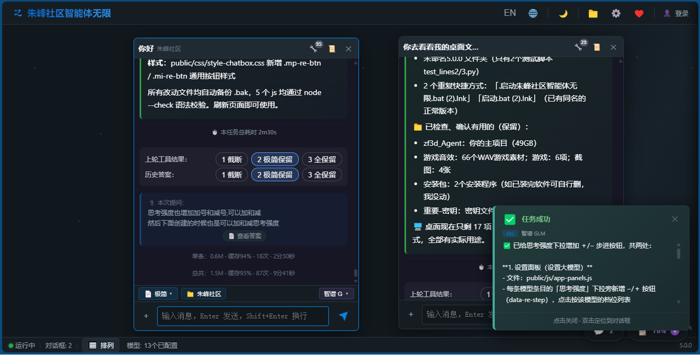
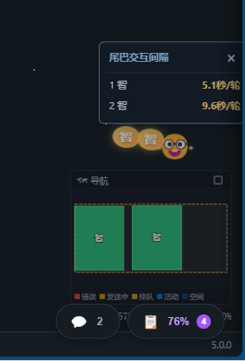
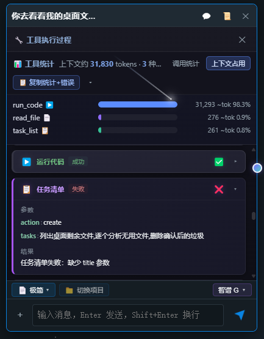
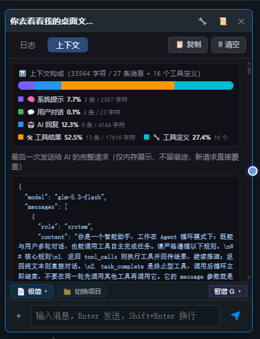
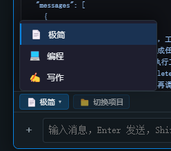

Zhufeng Community Agent Unlimited v4.1.8
No tricks, heavy tasks! Traditional agents walk; Zhufeng Agent Unlimited flies.

Free and open source · Multi-model, multi-chat · Windows / Web · Zero-dependency startup with Python standard library

## Screenshots

v4.1.8 Highlights
v4.1.8 builds on the v4.1.5 release with stability and usability improvements:

Complete help and onboarding: Product introduction, quick start, Agent modes, FAQs, and version history have been refined.
More reliable project panels: Save and restore behavior is improved to reduce the risk of losing project state.
More stable messages and chats: Chat-box integrity and parallel conversation reliability are improved.
Smoother rate-limit recovery: Automatic recovery reduces the impact of temporary rate limits.
Fresher model configuration cache: Model changes are reflected faster in the UI and chats.
Improved sign-in API compatibility: Better handling for different service configurations.
History and LLM statistics: Review tasks, model usage, and results.
Kite scheduling intervals: More predictable monitoring, scheduling, and result collection.
Model-aware token hit rates: Improved context reuse and model usage analysis.
What is it?
Zhufeng Community Agent Unlimited is a local-first AI agent workspace that brings multiple models, parallel conversations, long-running tasks, tool execution, and an infinite canvas together.

It is more than chat or a coding assistant: a desktop workspace that can run 400+ AI conversations at once. Each conversation is an independent agent with its own model, tools, context, and task state. Agents can delegate work, monitor progress, and collect results.

What can it do?
In one sentence: turn LLMs into a team that works on your computer.

Agents can read and write files, run code, fetch web pages, commit to Git, schedule tasks, search conversations, send email, manage memory, and ask for missing information.
Complex goals can be decomposed into task lists, completed step by step, and recovered after failure, including unattended work.
Multiple conversations can work in parallel: one conversation can supervise through the Kite system while others execute tasks.
Key Features
Infinite Canvas
Create chats with a right click, pan with middle-drag, zoom freely, and use the minimap to navigate. Organize task conversations visually, with up to 400+ task chat windows running at the same time.

Multi-Model Connectivity
Not tied to any single model: every session can take the best route. Supports DeepSeek, Qwen, Zhipu GLM, Doubao, Kimi, GPT, Claude, Gemini, Tencent Hunyuan, Baidu ERNIE, local Ollama, and any OpenAI-compatible API.

Agent Tool Modes
Mode	Tools	Best for
Minimal	29	Daily chat and general tasks
Coding	33	Development, Git operations, and code analysis
Writing	58	Content creation and AI text processing
Kite System
Chats monitor chats: a main conversation delegates work to others, supervises progress, and collects results for native multi-agent collaboration.

Message Queue
Messages sent while the AI is replying are queued automatically. Edit, delete, or auto-send them without losing ongoing work.

SQLite Persistence
Chats are saved locally every five seconds, with offline local-storage fallback when the backend is unavailable.

Zero-Dependency Launch
Pure Python standard library, double-click to run, no environment setup required. Frontend and backend hot reload make changes effective immediately.

Privacy and Interface
API keys are stored locally and masked in UI logs. The interface provides dark theme support, minimap navigation, Markdown, syntax highlighting, Mermaid diagrams, collapsible tool messages, and automatic chat titles.

How is it different?
Most agents focus on one window and one project context at a time. Zhufeng Agent Unlimited places all conversations on an infinite canvas and lets AI manage AI.

Capability	Zhufeng Agent Unlimited	Other coding agents
Infinite canvas	Native visual chat nodes	Usually unavailable
Parallel chats	Native parallelism, 400+ windows	Limited sessions
Model choice	Per-session model and compatible APIs	Product/account limited
AI managing AI	Kite delegation, monitoring, result collection	Scripts or subagents required
Long-running tasks	Native schedule / wait / monitor	External schedulers or CI
Long-term memory	Reusable across chats	Often not built in
Status visibility	All chat states on one canvas	Requires searching tabs
Quick Start
Download and extract the client, then double-click to launch.
Open Settings -> Model Management and enter the Base URL and API Key for any OpenAI-compatible API.
Right-click the canvas, create a chat, and select a model and tool mode.
For complex work, describe the background and expected result, then let the agent plan and execute.
Create additional chats for parallel work; each has its own model, context, and task state.
FAQ
Can I send messages while AI is replying? Yes. They are queued and processed in order.
What if a task fails? Failed chats can self-restart, and the status bar shows the reason.
Where is data stored? In a local SQLite database with automatic saving and offline fallback.
Must I restart after changing code? No. Frontend and backend hot reload make changes effective immediately.
How do multiple AIs work together? Use Kite tools such as monitor and chat_manage, or duplicate a session for A/B comparison.
About
Stay humble before large models. Let them play to their strengths: they help us choose what to do, reduce constraints, and accomplish more.

Made by Zhufeng Community, MIT licensed.

Website: zf3d.com
QQ Group: 290939358
朱峰社区智能体无限 v4.1.8
无套路，重任务！传统智能体 = 走路，朱峰智能体无限 = 飞行。

免费开源 · 多模型多对话 · Windows / Web 双端 · 零依赖启动（纯 Python 标准库，双击即用

v4.1.8 更新重点
v4.1.8 是在 v4.1.5 发布版基础上的稳定性与使用体验更新，重点包括：

帮助与介绍全面补齐：重新整理产品介绍、快速上手、三种 Agent 工具模式、常见问题和版本演进，让第一次使用更容易上手。
项目面板更可靠：完善项目面板的保存与恢复逻辑，降低切换或重新打开后项目状态丢失的风险。
消息与对话稳定性增强：修复聊天箱完整性相关问题，改善消息队列和多对话并行使用时的可靠性。
频控恢复更平滑：增加频率限制后的自动恢复处理，减少短暂限流对连续任务的影响。
模型文件缓存更及时：优化模型配置文件的缓存刷新，新增或修改模型后能更快反映到界面和对话中。
签到接口兼容性改进：增强签到相关接口的兼容处理，提升不同服务配置下的可用性。
历史与大模型统计：新增历史记录与大模型使用统计，便于回顾任务过程、了解模型调用情况和使用效果。
风筝系统间隔计算：完善风筝系统的任务间隔计算，让多对话监控、调度与回收过程更加稳定可控。
按模型优化 Token 命中率：针对不同模型优化 Token 命中率统计与处理策略，提升上下文复用效率和模型使用分析的准确性。
🖼️ 界面截图

这是什么？
朱峰社区智能体无限 是一个本地优先的智能体工作台：把多模型、多对话、长期任务、工具执行和无限画布，放进同一个工作空间。

它不是聊天软件，也不只是编程助手——它是一张可以同时运行 400+ 个 AI 对话的桌面。每个对话都是一个独立智能体：有自己的模型、自己的工具、自己的上下文，彼此之间还能互相委派任务、互相监控进度。

干什么的？
一句话：把大模型变成一支在你电脑里干活的团队。

AI 不只回答问题，还会自主读写文件、运行代码、联网抓取、Git 提交、定时调度、跨对话搜索、发邮件、管理记忆、向你提问
复杂目标自动拆解成任务清单逐步执行，失败自适应重启，无人值守也能跑完
多个对话并行开工：一个当"主管"盯进度（风筝系统），其他埋头干活
有什么特点？
🖼️ 无限画布
右键创建对话框，中键拖拽平移，随意缩放，小地图导航，超级快。自由组织对话节点，哪个优先做、哪个之后做一目了然，最多可同时开启 400+ 个任务对话窗口。

🧠 多模型连通
我不属于任何模型，每个会话走最佳线路。 DeepSeek、通义千问、智谱GLM、豆包、Kimi、GPT、Claude、Gemini、腾讯混元、百度文心、本地Ollama，任意 OpenAI 兼容接口，哪个最强走哪个。

🤖 Agent 工具模式
AI 不只是聊天。Agent 工具循环，让 AI 真正动手干活。每个对话独立选择模式，控制该智能体的能力范围：

模式	工具数	适合场景
📄 极简	29 个	日常对话、通用任务
💻 编程	33 个	代码开发（diff 预览、Git 日志、代码结构分析）
✍️ 写作	58 个	内容创作（41 个 AI 文本处理工具）
🪁 风筝系统（独有）
对话监控对话：主对话把任务分派给其他对话，守护监控并回收结果，天然的多智能体协作。

📋 消息队列
随意聊，随意停，AI 不会忘记你的任何一条消息。AI 回复期间新消息自动排队，支持编辑/删除/自动发送。

💾 SQLite 持久化
超快，超能大，大了自己分割。每 5 秒自动保存，对话永不丢失。后台离线自动回退本地存储，恢复后无缝切回。

⚡ 零依赖启动
零依赖，纯 Python 标准库，双击即用，无需安装任何环境。前后端分离，热更新改完即生效。模块化架构：app.js 拆 10 模块、server.py 拆 7 模块。

🔒 安全隐私 & 界面体验
密钥本地存储，界面日志全掩码，你的密钥不离开你的电脑。暗色主题、小地图导航、Markdown 渲染、代码高亮、Mermaid 图表、工具消息折叠、对话自动命名，全部安排。

快速上手
下载客户端，解压后双击启动。
打开「设置 → 模型管理」，填入任意 OpenAI 兼容接口的 Base URL 和 API Key。
在画布空白处右键创建对话，选择模型和 Agent 工具模式。
复杂任务先交代背景和预期结果，让智能体自动拆解并执行。
继续右键创建更多对话，每个对话独立模型、独立上下文、互不干扰。
💡 连通一个模型后，直接开个对话说"帮我连通其他模型"，它会协助你完成全部配置。

常见问题
AI 回复时还能发消息吗？ 可以。消息自动进入队列，AI 处理完当前任务后按序接收。
任务失败怎么办？ 失败自适应重启对话，配合离岗模式可实现无人值守，状态栏会显示失败原因。
数据保存在哪里？ SQLite 本地数据库，每 5 秒自动保存；后台离线时自动回退本地存储。
修改代码要重启吗？ 不需要。前后端分离 + 热更新，改完即生效。
怎么让多个 AI 一起干活？ 用风筝系统（monitor / chat_manage）分派任务，主对话守护监控并回收结果；也可以复制会话做 A/B 对照。
📜 关于
对于大模型，我们要敬畏。让大模型去发挥，我们人是渺小的，而大模型会帮我们选择干事，减少约束，获取更多。

朱峰社区出品，MIT 开源。

官网：zf3d.com
QQ 群：290939358