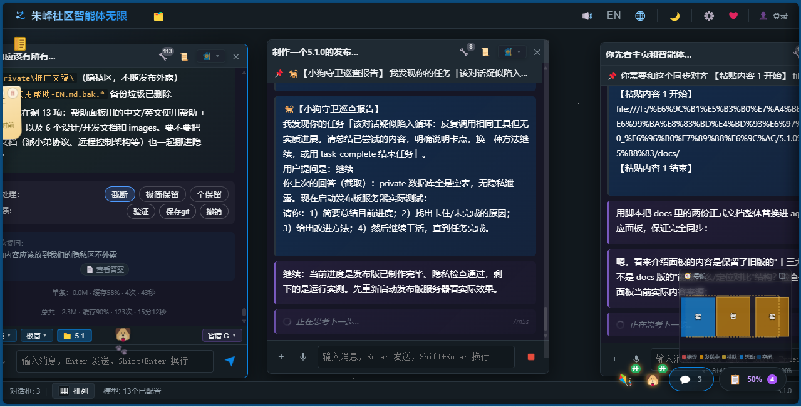
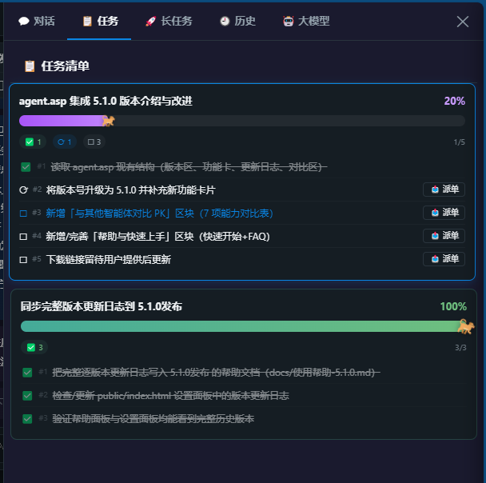
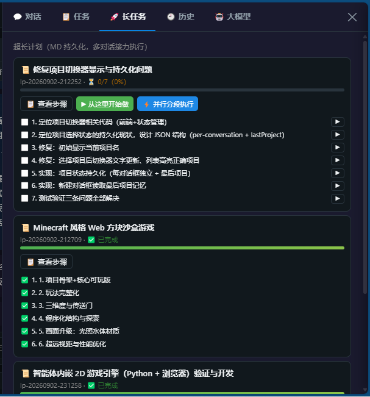
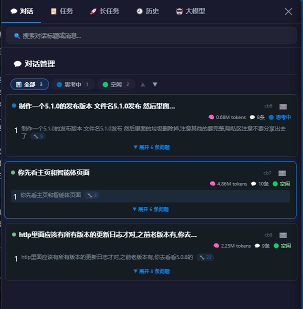
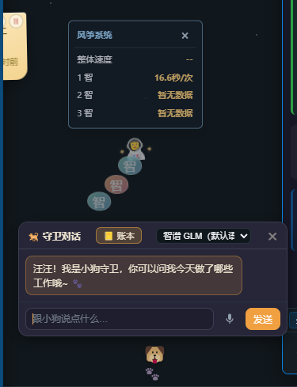
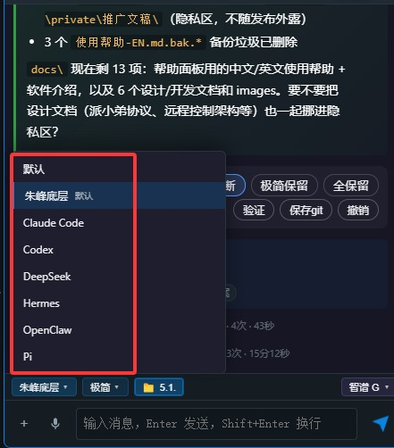
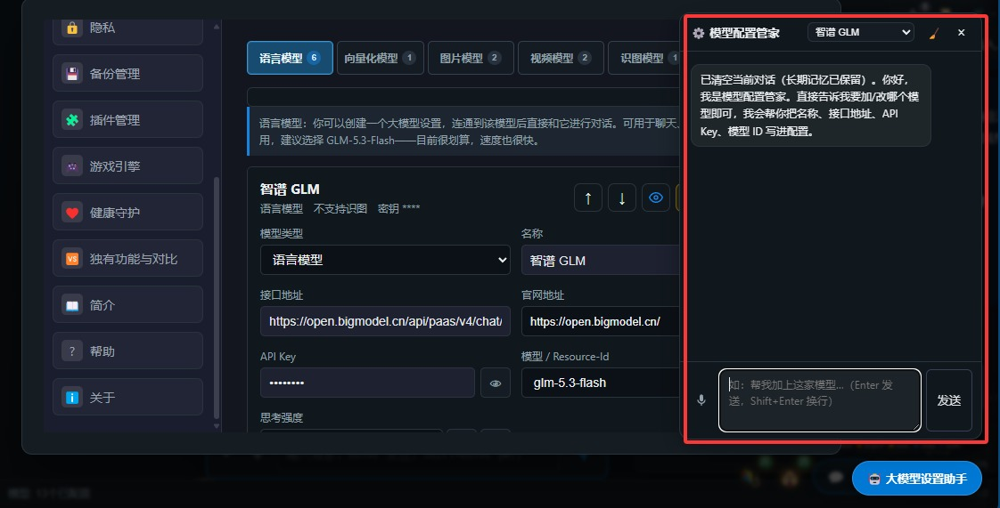
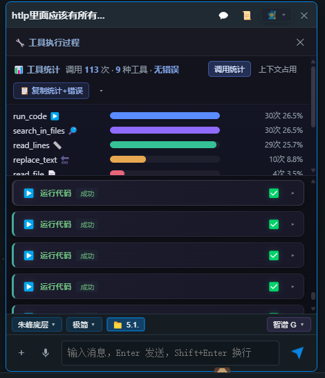

# 朱峰社区智能体无限（Infinity）5.1.0 · 软件介绍

## 一句话介绍

**一块无限画布，一个真正干活的 AI 团队。** 它不止会聊天——会拆解目标、调用工具、自主验证、失败自修，还能派出多个 AI「小弟」协作完成任务，甚至跨电脑互相远程操控。

免费开源 · 多模型多对话 · Windows / Linux / Web · 纯 Python 标准库零依赖双击即用

---

## 它能做什么？

一句话：**把大模型变成一支在你电脑上干活的团队。**

### 🧠 智能执行
- **真·自主执行**：读写文件、运行代码、联网抓取、Git 提交、定时任务、跨对话搜索、数据库、超长计划——不只回答，而是动手做完并验证
- **超长计划**：大任务自动拆批、跨对话接力，关掉软件明天接着干
- **双守护**：健康守护 + 小狗守卫，任务失败自动救、停滞主动干预

### 🤖 多智能体协作
- **400+ 对话并行**：每个对话都是独立智能体，有自己的模型、工具和上下文
- **派小弟协议**：主脑派活、小弟干活、监工验收，回执单 + 三关验收
- **风筝系统**：对话监控对话、风筝语音一对一聊天

### 🌐 连接一切
- **多模型**：DeepSeek、通义千问、智谱 GLM、豆包、Kimi、GPT、Claude、Gemini、混元、文心、Ollama，任意 OpenAI 兼容接口
- **六大底层引擎**：Claude Code / Codex / DeepSeek 直连 / Hermes / OpenClaw / Pi 风格，即插即用
- **扩展生态**：MCP 接入（含 3ds Max / Houdini 桥接）、技能系统、插件模式、声明式 UI

### 🎨 多模态创作
- 文生图、视频生成、TTS 语音、语音输入、像素动画、SVG 动画工坊
- **AIGC 发布系统**：AI 直接在朱峰社区发布作品

## 定位对比

| 传统 AI 聊天 | 朱峰智能体无限 |
|---|---|
| 一问一答 | 自主拆解、执行、验证、汇报 |
| 单对话 | 400+ 对话并行，多智能体派工协作 |
| 数据在云端 | 全部本地，API Key 存 private/ 不外传 |
| 要装环境配依赖 | 纯 Python 标准库，双击即用 |
| 出错人工兜底 | 守护进程自动救 + 回执验收 |

## 链接

| 渠道 | 链接 |
|---|---|
| 🏠 朱峰社区（介绍与下载） | https://www.zf3d.com/agent.asp |
| 🇨🇳 Gitee | https://gitee.com/zf3d/zf3d_agent |
| 🌍 GitHub | https://github.com/zf3dzf3dzf3d-ctrl/zf3d_agent |
| 📺 B站（演示与教程） | https://space.bilibili.com/39993282 |

详细功能与操作指南见：`docs/使用帮助-5.1.0.md`
